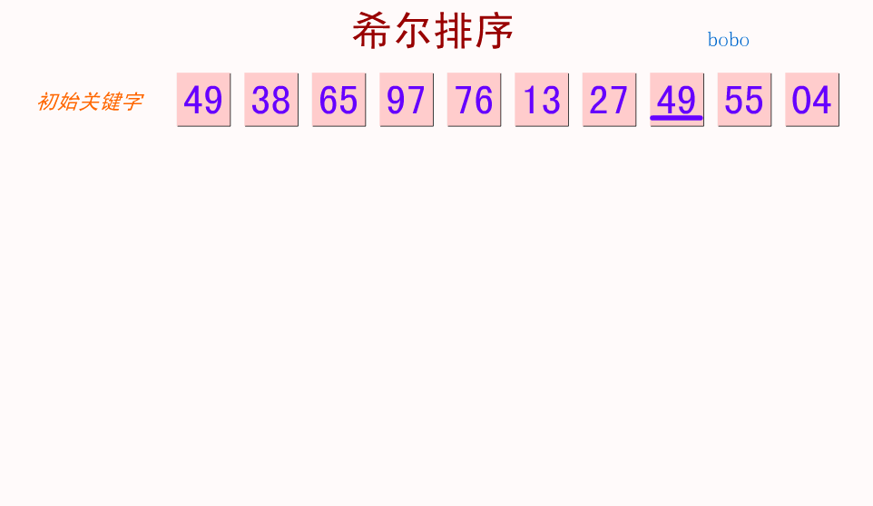
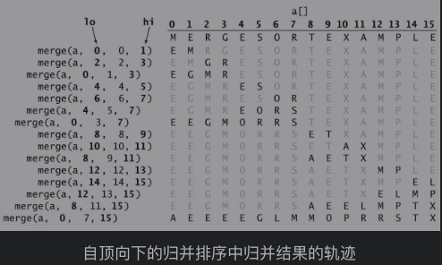
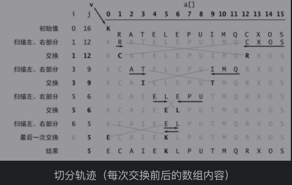
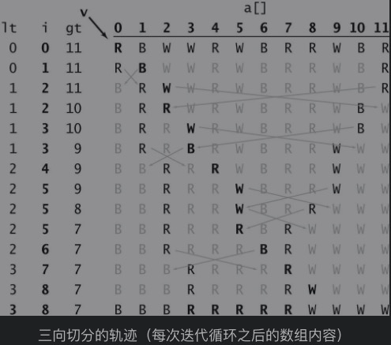
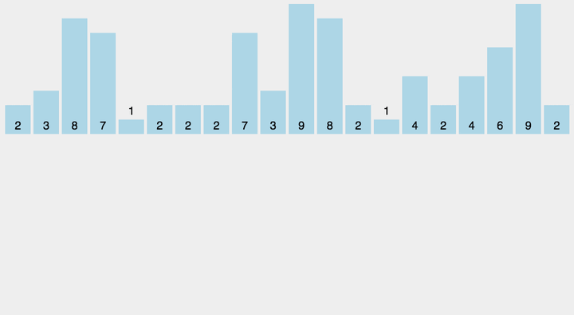
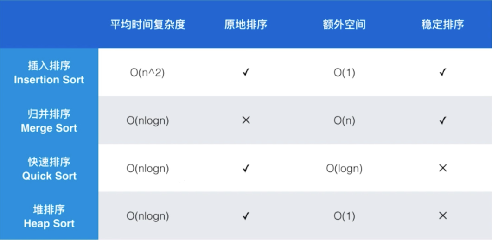

# 8个排序算法，你了解多少？

## 1 概述

&emsp;&emsp;学习排序算法的三大实际意义：

* 对排序算法的分析将有助于你全面理解比较算法性能的方法；
* 类似的技术也能有效解决其他类型的问题；
* 排序算法常常是我们解决其他问题的第一步。

## 2 约定

类及位置：com.code.art.sort

### 基础函数

```java
package com.code.art.sort;

/**
 * 描述:排序模板
 */
public class SampleSort {

    public static void sort(Comparable[] a) {

    }

    private static <T> boolean less(Comparable<T> v, Comparable<T> w) {
        return v.compareTo((T) w) < 0;
    }

    private static <T> void exch(Comparable<T>[] a, int i, int j) {
        Comparable<T> t = a[i];
        a[i] = a[j];
        a[j] = t;
    }
}
```

后续排序只会重点展示sort的代码

## 3 排序算法展示

| 序号 | 算法 | 类型 |
| ------ | ------ | ------ |
| 1 | 选择排序 | 普通 |
| 2 | 冒泡排序 | 普通 |
| 3 | 插入排序 | 普通 |
| 4 | 希尔排序 | 普通 |
| 5 | 归并排序 | 分治 |
| 6 | 快速排序 | 分治 |
| 7 | 桶排序 | 分治 |
| 8 | 基数排序 | 分治 |

### 3.1 选择排序

#### 图解&步骤


* 找min：找到数组最小的那个元素
* min替换：将它和数字的第一个元素交换位置
* 循环，从2个到第N个

#### 分析

#### 实现

```java
public class Selection {

    public static void sort(Comparable[] a) {
        for (int i = 0; i < a.length; i++) {
            int min = i;
            //遍历找到最小的元素
            for (int j = i + 1; j < a.length; j++)
                if (less(a[j], a[min])) min = j;
            //对元素进行交换
            exch(a, i, min);
        }
    }
}
```

### 3.2 冒泡排序

#### 图解&步骤


* 相邻元素对比：如果前者大则交换
* 索引+1：继续相邻元素比较
* 循环，从[0,a.length-1-循环次数]

#### 分析

#### 实现

```java
public class BubbleSort {

    public static void sort(Comparable[] a) {
        for (int i = 0; i < a.length; i++)
            //设置冒泡数量i（初始为0）
            //按冒泡范围j∈[0,a.length()-1-i)进行遍历
            for (int j = 0; j < a.length - 1 - i; j++)
                //冒泡操作：相邻元素j（初始值0）和j+1进行比较
                // 如a[j]>a[j+1]则交换位置
                if (less(a[j + 1], a[j]))
                    exch(a, j, j + 1);
    }
}
```

### 3.3 插入排序

#### 动图&步骤

* 确定需要插入的元素i（初始值为1）
* 不断与前1个元素比较，如果小于前者或达到头部则停止
* i+1循环前两步骤
#### 分析

#### 实现

```java
public class Insertion {

    public static void simpleSort(Comparable[] a) {
        for (int i = 1; i < a.length; i++) {
            //将a[j]插入到a[j-1]、a[j-2]...a[0]之中
            for (int j = i; j >= 1 && less(a[j], a[j - 1]); j--)
                exch(a, j, j - 1);
        }
    }
}
```

### 3.4 希尔排序

#### 步骤

* 有间隔的插入排序
#### 分析

#### 实现

```java
public class Shell {

    public static void sort(Comparable[] a) {
        //将a[]按升序排列
        for (int h = a.length / 2; h > 0; h /= 2)
            for (int i = h; i < a.length; i++)
                //将a[j]插入到a[j-h]、a[j-2h]、a[j-3h]...之中
                for (int j = i; j >= h && less(a[j], a[j - h]); j -= h)
                    exch(a, j, j - h);
    }
}
```

### 3.5 归并排序
算法设计中分治思想的典型应用
#### 图解&步骤

1. 声明一个静态数组aux，大小与数组长度相同
2. 进行递归排序调用
    1. 递归结束条件：索引高位≤低位
    2. 分别进行左边递归排序和右边递归排序
    3. 进行两个有序数组合并
3. 合并函数
    1. 将数组[lo,hi]复制至aux[lo.hi]
    2. 设置起始值i=lo，j=mid+1
    3. 按需进行数组合并
#### 分析
* 对于长度为N的任意数组，自顶向下的归并排序需要½NlgN至NlgN次比较
* 对于长度为N的任意数组，自顶向下的归并排序最多需要访问数组6NlgN次。

##### 优化点
1. 对小规模子数组使用插入排序
2. 将＜改成≤，提升效率
3. 不将元素复制到辅助数组

##### 优点
* 时间复杂度NlgN是排序算法中最低的

##### 缺点
* 空间复杂度不是最优的

#### 实现

```java
public class Merge {

    //归并所需的辅助数组
    private static Comparable[] aux;

    public static void sort(Comparable[] a) {
        aux = new Comparable[a.length];
        sort(a, 0, a.length - 1);
    }

    //将数组a[lo..li]排序
    private static void sort(Comparable[] a, int lo, int hi) {
        if (hi <= lo) return;
        int mid = lo + (hi - lo) / 2;
        //将左半边排序
        sort(a, lo, mid);
        //将右半边排序
        sort(a, mid + 1, hi);
        //归并结果
        merge(a, lo, mid, hi);
    }

    //将a[lo..mid]和a[mid+1..hi]归并
    private static void merge(Comparable[] a, int lo, int mid, int hi) {
        int i = lo;
        int j = mid + 1;
        //j将a[lo..hi]复制到aux[lo..hi]
        for (int k = lo; k <= hi; k++) aux[k] = a[k];
        //归并回到a[lo..hi]
        for (int k = lo; k <= hi; k++) {
            if (i > mid) a[k] = aux[j++];
            else if (j > hi) a[k] = aux[i++];
            else if (less(aux[j], aux[i])) a[k] = aux[j++];
            else a[k] = aux[i++];
        }
    }
}
```

### 3.6 快速排序

#### 图&步骤



##### 双路快排

1. 进行数组随机打散（防止最坏情况出现）
2. 进行递归排序调用
    1. 选择lo元素作为切分元素，寻找lo元素val在[lo,hi]中的位置
    2. 从lo向hi寻找比val大的元素，从hi向lo寻找比val小的元素，找到1对则进行值交换
    3. 直至确定lo在[lo,hi]中对应的位置j，将lo位置元素j位置进行交换，返回j
    4. 将数组分成[lo,j]和[j+1, hi]两部分继续进行递归

##### 3路快排



#### 分析

##### 优点

* 比较次数少
* 原地排序，不需要额外的空间
* 排序数组所需的时间和NlgN成正比

##### 缺点

* 非常脆弱
    * 极端情况下它的性能是平方级别的

##### 改进点

* 小数组切换到插入排序
* 三取样切分

#### 实现

```java
public class Quick {

    public static void sort(Comparable[] a) {
        //StdRandom.shuffle(a); //消除对输入的依赖
        sort(a, 0, a.length - 1);
        //sort3way(a, 0, a.length - 1);
    }

    //将数组a[lo..li]排序
    private static void sort(Comparable[] a, int lo, int hi) {
        if (hi <= lo) return;
        // 元素过少的时候使用插入排序优化
        // if (hi <= lo + 16) { Insertion.sort(a);return; }
        int i = lo, j = hi + 1; //左右扫描指针
        Comparable v = a[lo];
        while (true) {//扫描左右，检查是否结束并交换元素
            while (less(a[++i], v)) if (i == hi) break;
            while (less(v, a[--j])) if (j == lo) break;
            if (i >= j) break;
            exch(a, i, j);
        }
        exch(a, lo, j); //将v = a[j]放入正确的位置

        sort(a, lo, j - 1);  //将左半部分a[lo..i]排序
        sort(a, i, hi); //将右半部分a[i+1..hi]排序
    }

    private static void sort3way(Comparable[] a, int lo, int hi) {
        if (hi <= lo) return;
        // 元素过少的时候使用插入排序优化
        // if (hi <= lo + 16) { Insertion.sort(a);return; }
        int lt = lo, i = lo + 1, gt = hi;

        Comparable v = a[lo];
        while (i <= gt) {
            int cmp = a[i].compareTo(v);
            if (cmp < 0) exch(a, lt++, i++);
            else if (cmp > 0) exch(a, i, gt--);
            else i++;
        }
        sort(a, lo, lt - 1);
        sort(a, gt + 1, hi);
    }
}
```

### 3.7 计数排序
#### 图&步骤
1. 找出待排序的数组中最大和最小的元素
2. 统计数组中每个值为i的元素出现的次数，存入数组C的第i项
3. 对所有的计数累加（从C中的第一个元素开始，每一项和前一项相加）
4. 反向填充目标数组：将每个元素i放在新数组的第C(i)项，每放一个元素就将C(i)减去1
   
#### 分析

#### 实现


### 3.8 桶排序

#### 图&步骤

1. 在待排序数组中找出最大值max和最小值min，并根据“bucketNum=（max-min）/arr.length+1”创建桶。
2. 遍历待排序的数组arr，计算每个元素arr[i]的大小并放入桶中
3. 对每个桶各自排序，在每个桶的内部排序完成后就得到了完整的排序数组。

#### 分析

#### 实现

```java
public class Bucket {
    public static int[] sort(int[] a) {
        int max = Integer.MIN_VALUE;
        int min = Integer.MAX_VALUE;
        for (int i = 0; i < a.length; i++) {
            max = Math.max(max, a[i]);
            min = Math.min(min, a[i]);
        }

        //创建桶
        int bucketNum = (max - min) / a.length + 1;
        ArrayList<ArrayList<Integer>> bucketArr = new ArrayList<ArrayList<Integer>>(bucketNum);
        for (int i = 0; i < bucketNum; i++)
            bucketArr.add(new ArrayList<Integer>());

        //将每个元素都放入桶中
        for (int i = 0; i < a.length; i++) {
            int num = (a[i] - min) / a.length;
            bucketArr.get(num).add(a[i]);
        }

        bucketArr.forEach(Collections::sort);

        int i = 0;
        for (ArrayList<Integer> bucket : bucketArr)
            for (Integer e : bucket) {
                a[i] = e;
                i++;
            }
        return a;
    }
}
```

### 3.9 基数排序

#### 图&步骤
1. 将所有待比较数值（正整数）统一为同样的数位长度，数位较短的数前面补零。
2. 从最低位开始，依次进行一次排序。
3. 这样从最低位排序一直到最高位排序完成以后, 数列就变成一个有序序列。
   
[知乎链接](https://zhuanlan.zhihu.com/p/126116878)
#### 分析

#### 实现

### 3.10 堆排序

#### 图&步骤

#### 分析

#### 实现

## 4 常用排序比较



## CHANGELOG

##### 2021年03月16日16:04:40 创建

##### 2021年03月23日15:56:28 补充图解
